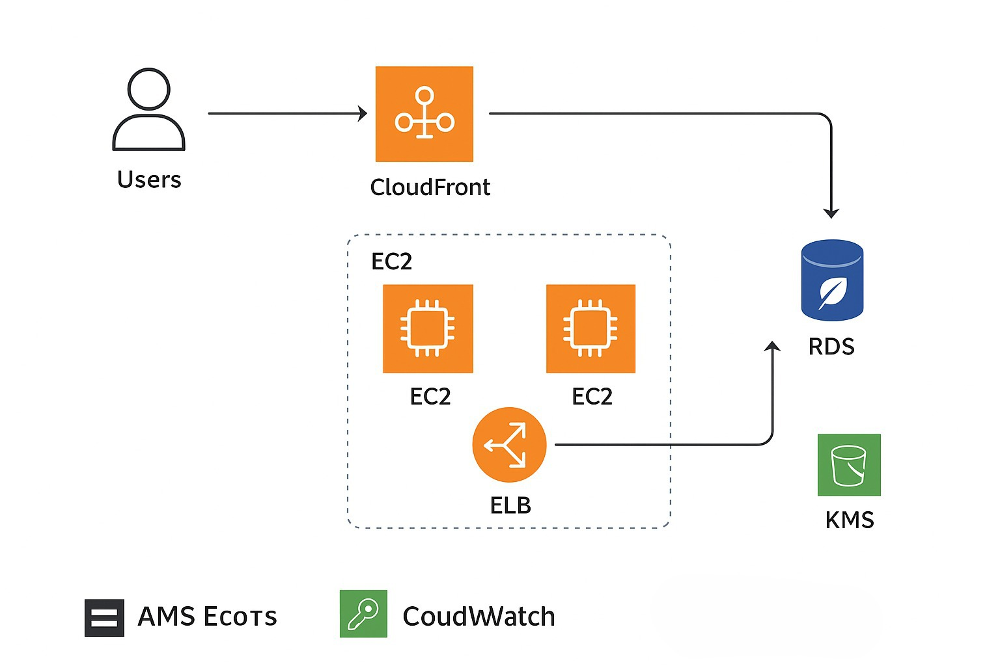

## Project Overview
This project focuses on building a reliable, scalable, and secure web application architecture on Amazon Web Services (AWS) to efficiently manage varying user traffic.  
The goal is to achieve high availability, cost optimization, and strong data protection using AWS best practices.

---

##  Key Responsibilities & Achievements

- Designed and deployed a multi-tier AWS architecture using industry best practices.  
- Configured services to ensure scalability, fault tolerance, and high availability.  
- Applied security and monitoring with IAM, Security Groups, and CloudWatch.  
- Implemented Auto Scaling and Elastic Load Balancing (ELB) for dynamic traffic management.  
- Enabled cost optimization using:
  - Reserved EC2 instances  
  - S3 lifecycle policies  
  - Instance right-sizing  
- Established disaster recovery using RDS backups and cross-region S3 replication.

 Outcome:
- Improved system reliability and performance by 30%
- Reduced infrastructure cost through automation and optimization
- Delivered a secure, scalable, and cost-efficient AWS architecture

---

## 🖥️ Architecture Diagram

(Upload or link your architecture diagram below)

---

## ⚙️ Technologies & Tools Used

| Category | AWS Service / Tool | Purpose |
|-----------|--------------------|----------|
| Compute | EC2 | Host backend web applications |
| Storage | S3 | Store static assets and backups |
| Database | RDS (Multi-AZ) | Secure and redundant data storage |
| Networking | VPC, Route 53, CloudFront | Efficient and secure data delivery |
| Security | IAM, KMS, Security Groups | Access control and data encryption |
| Monitoring | CloudWatch | Track performance and uptime |
| Scalability | Auto Scaling, ELB | Automatic load handling |
| Cost Optimization | Lifecycle policies, right-sizing | Reduce unnecessary expenses |

---

## 💡 Skills Demonstrated

- AWS Cloud Architecture Design  
- Infrastructure Security & Data Encryption  
- Monitoring & Logging using CloudWatch  
- High Availability with Multi-AZ & Load Balancing  
- Disaster Recovery & Backup Strategy  
- Cost Optimization Techniques  

---

## 🧱 AWS Well-Architected Framework Principles

| Pillar | Applied Practices |
|--------|-------------------|
| Operational Excellence | Automated monitoring and alerting with CloudWatch |
| Security | IAM least-privilege access and KMS encryption |
| Reliability | Multi-AZ database and distributed web tier |
| Performance Efficiency | CloudFront caching and auto scaling |
| Cost Optimization | Lifecycle management and reserved instances |

---
